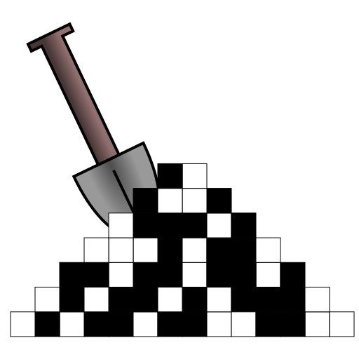

  

# dig_it_all

Workspace to learn basic digital design techniques and languages.

## Current content

- Simple VHDL example, which I'm using to refresh my familiarity with digital design and to learn [GHDL](https://github.com/ghdl/ghdl).

## Getting started

A first [test-bench](./tb_main.vhdl) for a simple [sequence cycler](./blind_cycler.vhdl) can be run following the basics steps noted down [here](./command_notes.md).

## TODO:
- [] create a proper script for GHDL (e.g. based on [GHDL command notes](./ghdl_command_notes.md)).
- [] implement blind_cycler in Verilog (sim with [Icarus Verilog](https://github.com/steveicarus/iverilog))
- [] implement blind_cycler in SystemVerilog (sim with [Verilator](https://github.com/verilator/verilator))
- [] separate source files according to language
